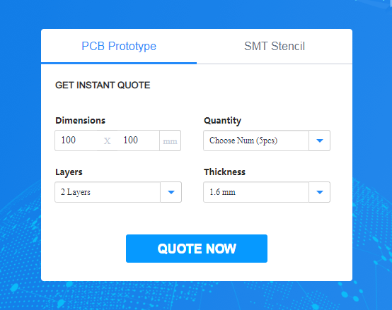
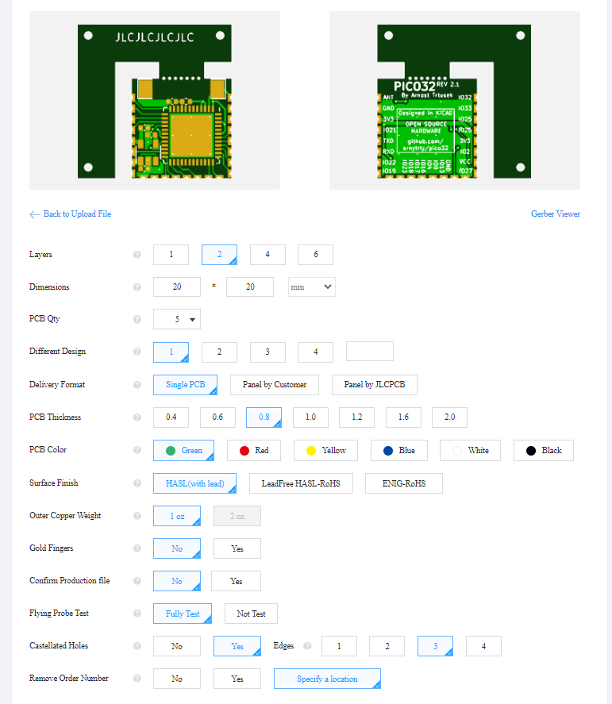
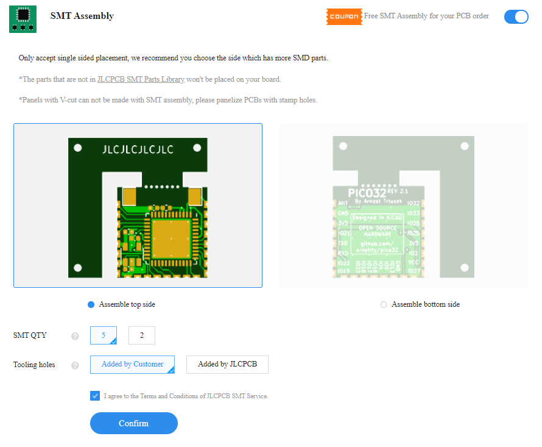
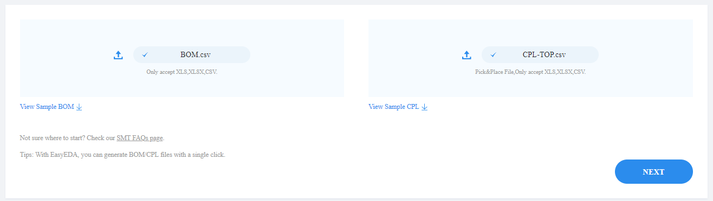
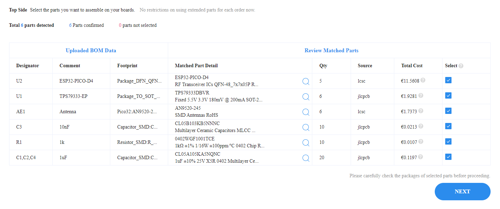
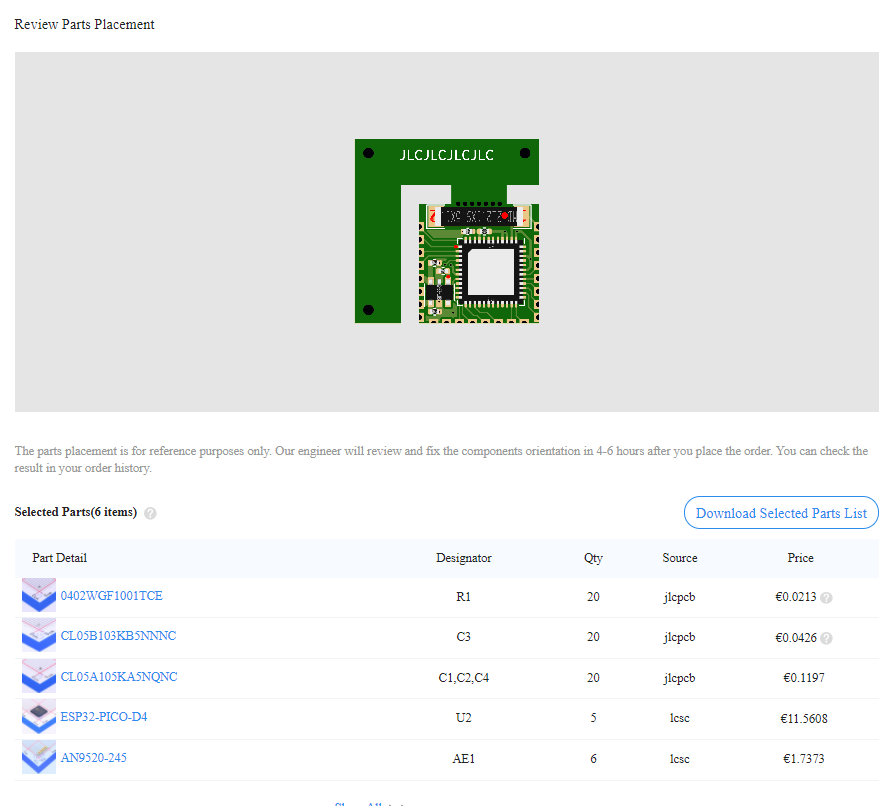

# Ordering Pico32

This is how you can order Pico32 from [JLCPCB](https://jlcpcb.com/).

---

Go to [jlcpcb.com](https://jlcpcb.com/) & click *QUOTE NOW*.

Load Gerber (`gerber.zip`) & set PCB thickness to 0.8mm (thinnest for the same price); Remove order number set to Specify Location and if you use revision two - enable Cascellated holes and set to three sides.

In bottom enable SMT assembly; set it to top side; set tooling holes to added by customer & Confirm.

Add BOM & CPL (`BOM.csv` & `CPL-TOP.csv`) & click next.

Check if all parts are in stock & click next.

Check if all parts are well place (they should fix them if not); click save to cart & finish order :D.

