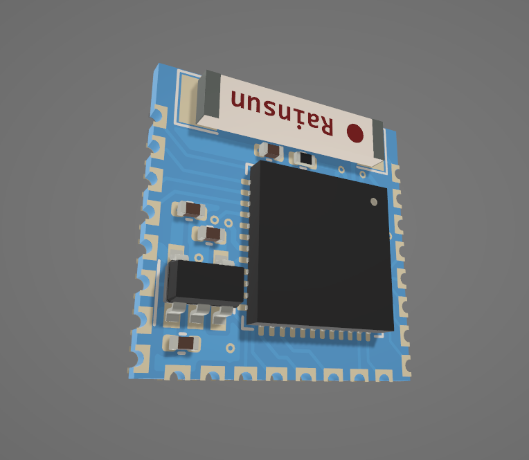
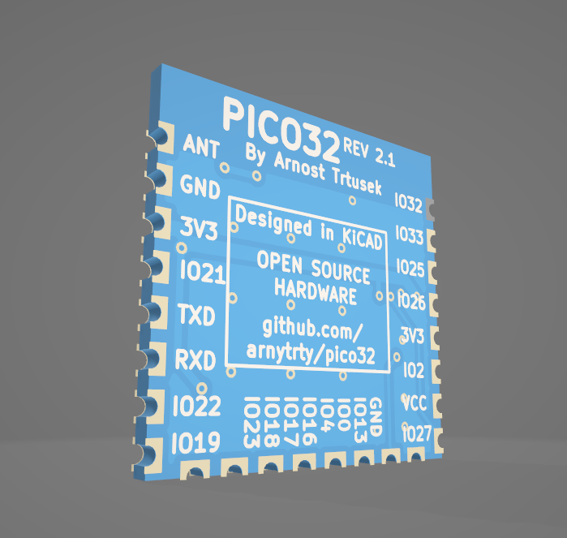
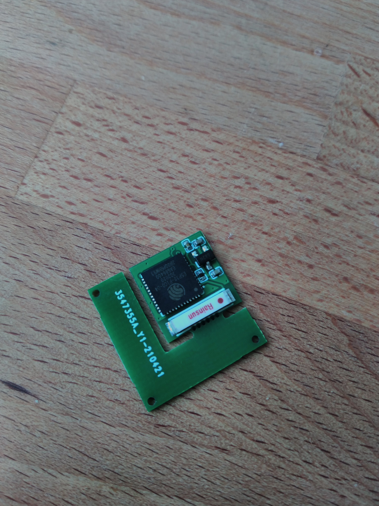
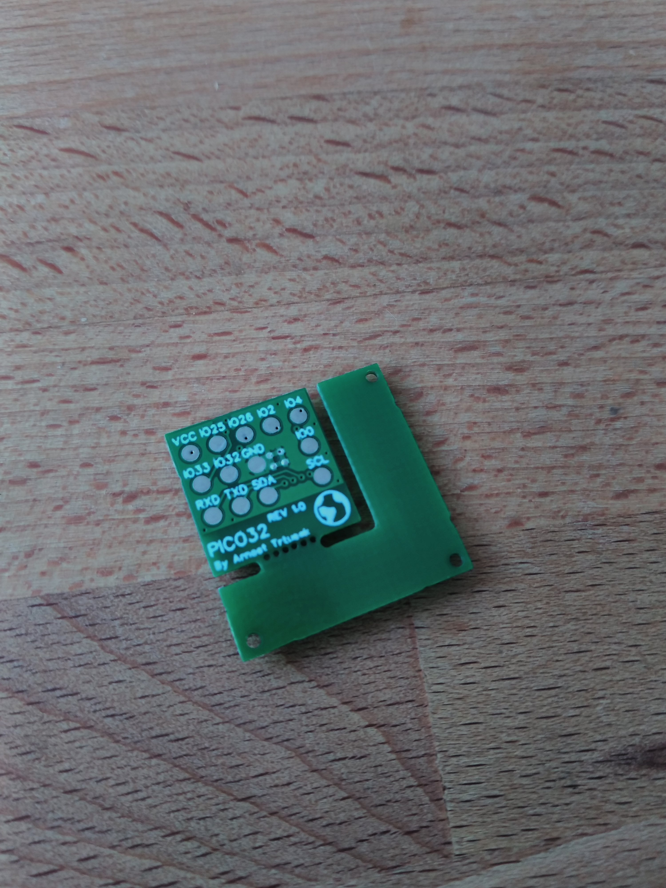
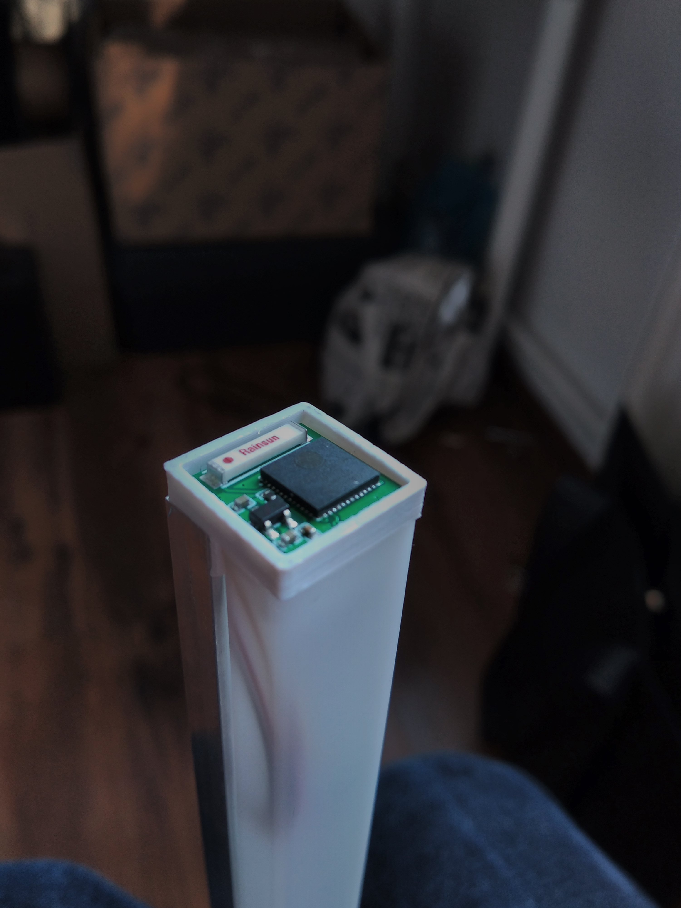
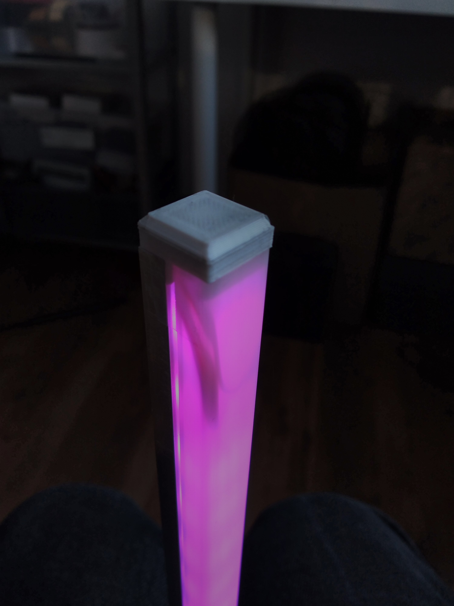

# Arnytrty Pico32

Pico32 is small (13mm*13mm) open source board based on ESP32-PICO-D4. It was designed for full use of the SoC package from Espressif & make it more accessible so you can simply handsolder without any special tools. It have 4MB embedded flash ([esp32-pico-d4 datasheet](https://www.espressif.com/sites/default/files/documentation/esp32-pico-d4_datasheet_en.pdf)).

This board does not have USB to UART converter, you will need external one to program it (they are pretty cheap). For programming guide, check out [`FLASHING.md`](FLASHING.md) guide.

---

## Files & Revisions:

Main folders:

| Name | Content |
|:-----|:--------|
| hardware | board CAD files |
| images | images of the board |
| models | Exported 3D models |
| order | GERBER, BOM & CPL files |

Subfolders:
| Name | Revision | Tested | Comment |
|:-----|:--------:|:------:|:--------|
| pico32_v1_jlcpcb_assembly | v1 | YES | got removeable frame to match jlcpcb assembly requirements; designed in [EasyEDA](https://easyeda.com/); fully working, but have pins from bootm & got only 100mA regulator
| pico32_v2 | v2 | NO | pins from side; better regulator; designed in [KiCad](https://www.kicad.org/)
| pico32_v2_jlcpcb_assembly | v2 | NO | got removeable frame to match jlcpcb assembly requirements, other same as pico32_v2

***Currently I dont sell these myself, but you can check how to buy them for yourself on [ORDER.md](ORDER.md) guide.***

# Revisions

## v2

This version is more universal than the firts one, it also remove flaws of the v1. It have same footprint as before (13mm*13mm), but instead of having pads on the bootom, it got cascellated trough holes on sides so you can easily solder it on homemade PCB.

Known issues:
* NONE

## v1

This was used as the test of how many components ESP32-PICO-D4 needs, it works pretty well, but if you use CPU speed over 80MHz it will throw `Brownout detector was triggered`. With its 13mm*13mm footprint, you can simply fit it in ending of aluminium profile & control rgb leds with it.

Known issues:
* Wrong LDO - only 100mA
* Too small capacitors ?

